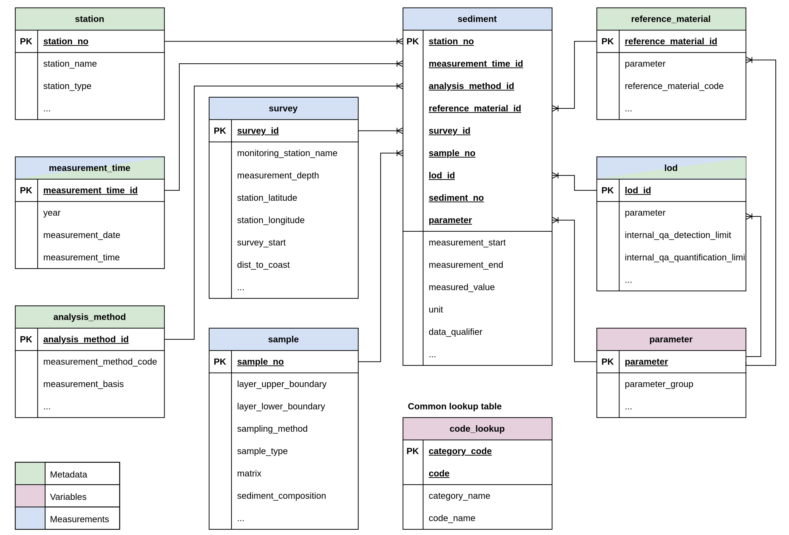

```{css, echo=FALSE}
th {
  white-space: nowrap;
}
```

```{r setup, include=FALSE}
library(tibble)
```

The page shows the database schema diagram along with table definitions based on the MUDAB dataset.

## DB Schema Diagram

The proposed database design shown in the ER (Entity Relationship) diagram below contains nine tables including three meta (entity) tables, five variable (look-up or reference) tables, and one fact (measurement) table.

The columns with `PK` in the diagram indicate primary keys of the table, which guarantees unique identifications.

{.zoomable}

## code_lookup

Vocabulary reference table mapping category codes and individual codes to their human-readable names.

```{r}
tribble(
  ~Name,             ~`Data Type`, ~PK,  ~FK,  ~`NA Allowed`, ~Description,                                                                      ~`Look Up`,
  "category_code",   "TEXT",       "✓",  "",    FALSE,         "Primary Key. Category code identifying the vocabulary domain (e.g. ICESCL_MATRIX).", "",
  "category_name",   "TEXT",       "",   "",    TRUE,          "Human-readable name of the category.",                                             "",
  "code",            "TEXT",       "✓",  "",    FALSE,         "Primary Key. Individual code value within the category.",                          "",
  "code_name",       "TEXT",       "",   "",    TRUE,          "Human-readable name or description of the individual code.",                       ""
)
```

---

## station

Sampling station metadata including location, responsible institute, and classification.

```{r}
tribble(
  ~Name,                   ~`Data Type`, ~PK,  ~FK,                               ~`NA Allowed`, ~Description,                                                    ~`Look Up`,
  "station_no",            "INTEGER",    "✓",  "",                                FALSE,         "Primary Key. Auto-generated surrogate key for the station.",     "",
  "station_name",          "TEXT",       "",   "",                                FALSE,         "Station identifier name or code.",                               "",
  "station_id",            "INTEGER",    "",   "",                                FALSE,         "Original station identifier from the source database.",          "",
  "responsible_institute", "TEXT",       "",   "",                                TRUE,          "Institute responsible for the station.",                         "MUDABCL_INSTITUTE",
  "region",                "TEXT",       "",   "",                                TRUE,          "Sea region (e.g. North Sea, Baltic Sea).",                       "",
  "institute",             "TEXT",       "",   "",                                TRUE,          "Institute code for the measuring laboratory.",                   "MUDABCL_INSTITUTE",
  "latitude",              "REAL",       "",   "",                                TRUE,          "Latitude coordinate (decimal degrees).",                         "",
  "longitude",             "REAL",       "",   "",                                TRUE,          "Longitude coordinate (decimal degrees).",                        "",
  "organisation",          "TEXT",       "",   "",                                TRUE,          "Organisation type (e.g. NATIONAL, OSPAR, HELCOM).",              "MUDABCL_ORGANISATION",
  "project_affiliation",   "TEXT",       "",   "",                                TRUE,          "Monitoring programme affiliation (e.g. BLMP+).",                 "",
  "station_type",          "TEXT",       "",   "",                                TRUE,          "Station type classification.",                                   "MUDABCL_STATIONTYPE",
  "water_body_category",   "TEXT",       "",   "",                                TRUE,          "Water body category code.",                                      "ICESCL_MSTAT"
)
```

---

## parameter

Chemical or physical parameters measured in the sediment.

```{r}
tribble(
  ~Name,              ~`Data Type`, ~PK,  ~FK,  ~`NA Allowed`, ~Description,                                                  ~`Look Up`,
  "parameter",        "TEXT",       "✓",  "",    FALSE,         "Primary Key. ICES parameter code (e.g. HG, CD, ZN).",         "ICESCL_PARAM",
  "parameter_name",   "TEXT",       "",   "",    TRUE,          "Full name of the parameter (e.g. mercury, cadmium).",         "",
  "parameter_group",  "TEXT",       "",   "",    TRUE,          "Parameter group code (e.g. I-MET for metals and metalloids).", "ICESCL_PARAMGROUP",
  "cas_number",       "TEXT",       "",   "",    TRUE,          "Chemical Abstracts Service registry number.",                 "",
  "lawa_code",        "REAL",       "",   "",    TRUE,          "German LAWA parameter identifier code.",                      ""
)
```

---

## measurement_time

Date and time information for each measurement event.

```{r}
tribble(
  ~Name,                  ~`Data Type`, ~PK,  ~FK,  ~`NA Allowed`, ~Description,                                                                          ~`Look Up`,
  "measurement_time_id",  "INTEGER",    "✓",  "",    FALSE,         "Primary Key. Auto-generated surrogate key.",                                          "",
  "year",                 "REAL",       "",   "",    TRUE,          "Year of measurement.",                                                                "",
  "measurement_date",     "TEXT",       "",   "",    TRUE,          "Full date of measurement (ISO format: YYYY-MM-DD).",                                  "",
  "measurement_time",     "TEXT",       "",   "",    TRUE,          "Time of measurement (HH:MM). Stored as text; 00:00 indicates time not recorded.",     ""
)
```

---

## analysis_method

Laboratory analysis methods used for each measurement, including chemical and physical treatments.

```{r}
tribble(
  ~Name,                     ~`Data Type`, ~PK,  ~FK,  ~`NA Allowed`, ~Description,                                                            ~`Look Up`,
  "analysis_method_id",      "INTEGER",    "✓",  "",    FALSE,         "Primary Key. Auto-generated surrogate key.",                            "",
  "measurement_method_code", "TEXT",       "",   "",    TRUE,          "Analytical measurement method code (e.g. AAS-CV, ICP-OES).",            "ICESCL_METOA",
  "chemical_treatment",      "TEXT",       "",   "",    TRUE,          "Chemical treatment applied to the sample (e.g. HF-C, HNO).",            "ICESCL_METCX",
  "physical_treatment",      "TEXT",       "",   "",    TRUE,          "Physical pre-treatment applied to the sample (e.g. DFRZ = freeze-drying).", "ICESCL_METPT",
  "measurement_basis",       "TEXT",       "",   "",    TRUE,          "Basis of measurement (e.g. D = dry weight).",                          "ICESCL_BASIS",
  "accreditation",           "TEXT",       "",   "",    TRUE,          "Accreditation status of the analytical laboratory.",                    "",
  "analytical_laboratory",   "TEXT",       "",   "",    TRUE,          "Code of the laboratory that performed the analysis.",                   "ICESCL_RLABO",
  "control_chart_type",      "TEXT",       "",   "",    TRUE,          "Type of control chart used for internal quality assurance.",            "",
  "discipline",              "TEXT",       "",   "",    TRUE,          "Measurement discipline (e.g. C = chemistry).",                          "",
  "proficiency_testing",     "TEXT",       "",   "",    TRUE,          "Reference to proficiency testing participation.",                       ""
)
```

---

## reference_material

Reference material used for quality assurance during chemical analysis.

```{r}
tribble(
  ~Name,                      ~`Data Type`, ~PK,  ~FK,                          ~`NA Allowed`, ~Description,                                                  ~`Look Up`,
  "reference_material_id",    "INTEGER",    "✓",  "",                           FALSE,         "Primary Key. Auto-generated surrogate key.",                  "",
  "parameter",                "TEXT",       "",   "parameter (parameter)",      FALSE,         "Foreign Key. Parameter this reference material applies to.",  "",
  "reference_material_code",  "TEXT",       "",   "",                           TRUE,          "Identifier code for the reference material.",                 "",
  "reference_material_basis", "TEXT",       "",   "",                           TRUE,          "Basis on which the reference material is characterised.",     "",
  "reference_material_type",  "TEXT",       "",   "",                           TRUE,          "Type of reference material.",                                 "",
  "reference_material_sd",    "REAL",       "",   "",                           TRUE,          "Certified standard deviation of the reference material.",     "",
  "reference_material_mean",  "REAL",       "",   "",                           TRUE,          "Certified mean value of the reference material.",             ""
)
```

---

## survey

Survey and voyage metadata linking measurements to spatial and temporal context.

```{r}
tribble(
  ~Name,                     ~`Data Type`, ~PK,  ~FK,  ~`NA Allowed`, ~Description,                                              ~`Look Up`,
  "survey_id",               "INTEGER",    "✓",  "",    FALSE,         "Primary Key. Auto-generated surrogate key.",              "",
  "monitoring_station_name", "TEXT",       "",   "",    TRUE,          "Name or code of the monitoring station.",                 "",
  "measurement_depth",       "REAL",       "",   "",    TRUE,          "Depth of measurement (m).",                               "",
  "station_latitude",        "REAL",       "",   "",    TRUE,          "Latitude of the monitoring station (decimal degrees).",   "",
  "station_longitude",       "REAL",       "",   "",    TRUE,          "Longitude of the monitoring station (decimal degrees).",  "",
  "measurement_project",     "TEXT",       "",   "",    TRUE,          "Monitoring project name or code.",                        "",
  "survey_start",            "REAL",       "",   "",    TRUE,          "Survey start date (integer format YYYYMMDD).",            "",
  "survey_end",              "REAL",       "",   "",    TRUE,          "Survey end date (integer format YYYYMMDD).",              "",
  "vessel_code",             "TEXT",       "",   "",    TRUE,          "Vessel identifier code.",                                 "ICESCL_SHIPC",
  "platform_type",           "TEXT",       "",   "",    TRUE,          "Type of sampling platform.",                              "MUDABCL_PLATFORMTYPE",
  "vessel_name",             "TEXT",       "",   "",    TRUE,          "Name of the sampling vessel.",                            "",
  "dist_to_coast",           "REAL",       "",   "",    TRUE,          "Distance to the nearest coastline (km), computed with seastamp.", "",
  "est_country",             "TEXT",       "",   "",    TRUE,          "Nearest country (Natural Earth).",                        "",
  "country_code",            "TEXT",       "",   "",    TRUE,          "ISO 3166-1 alpha-3 code of the nearest country (e.g. DEU).", "",
  "municipality",            "TEXT",       "",   "",    TRUE,          "Nearest municipality (Eurostat GISCO LAU), Europe only.", "",
  "sea_name",                "TEXT",       "",   "",    TRUE,          "Sea or ocean name (IHO Sea Areas v3).",                   ""
)
```

---

## lod

Limits of detection and quantification per parameter measurement.

```{r}
tribble(
  ~Name,                              ~`Data Type`, ~PK,  ~FK,                      ~`NA Allowed`, ~Description,                                                      ~`Look Up`,
  "lod_id",                           "INTEGER",    "✓",  "",                       FALSE,         "Primary Key. Auto-generated surrogate key.",                      "",
  "parameter",                        "TEXT",       "",   "parameter (parameter)",  FALSE,         "Foreign Key. Parameter this limit applies to.",                   "",
  "internal_qa_detection_limit",      "REAL",       "",   "",                       TRUE,          "Internal quality assurance limit of detection value.",            "",
  "internal_qa_quantification_limit", "REAL",       "",   "",                       TRUE,          "Internal quality assurance limit of quantification value.",       "",
  "expanded_uncertainty_pct",         "REAL",       "",   "",                       TRUE,          "Expanded measurement uncertainty expressed as a percentage.",     "",
  "uncertainty_method",               "TEXT",       "",   "",                       TRUE,          "Method used to determine the measurement uncertainty.",           "ICESCL_METCU"
)
```

---

## sample

Physical sample metadata including sediment layer depth, matrix, and field observations.

```{r}
tribble(
  ~Name,                  ~`Data Type`, ~PK,  ~FK,  ~`NA Allowed`, ~Description,                                                                           ~`Look Up`,
  "sample_no",            "INTEGER",    "✓",  "",    FALSE,         "Primary Key. Auto-generated surrogate key.",                                           "",
  "sample_id",            "TEXT",       "",   "",    TRUE,          "Original sample identifier from the source database.",                                 "",
  "layer_upper_boundary", "REAL",       "",   "",    TRUE,          "Upper depth boundary of the sampled sediment layer (cm).",                             "",
  "layer_lower_boundary", "REAL",       "",   "",    TRUE,          "Lower depth boundary of the sampled sediment layer (cm).",                             "",
  "sampling_method",      "TEXT",       "",   "",    TRUE,          "Method used to collect the sample (e.g. BC = box corer, VV = Van Veen grab).",         "",
  "flag",                 "TEXT",       "",   "",    TRUE,          "Data quality flag.",                                                                   "ICESCL_VFLAG",
  "matrix",               "TEXT",       "",   "",    TRUE,          "Sediment matrix fraction code (e.g. SED20, SED63, SED2000).",                          "ICESCL_MATRIX",
  "sediment_composition", "TEXT",       "",   "",    TRUE,          "Field description of the sediment composition (translated to English).",               "",
  "sediment_content",     "TEXT",       "",   "",    TRUE,          "Field description of the sediment content (translated to English).",                   "",
  "sampled_area",         "REAL",       "",   "",    TRUE,          "Area of the seafloor sampled (cm²). -9999 indicates not recorded.",                    ""
)
```

---

## sediment

Measurement table storing the actual analytical results. Each row represents one parameter value from one sample at one station, linked to all relevant metadata tables via foreign keys.

```{r}
tribble(
  ~Name,                    ~`Data Type`, ~PK,  ~FK,                                           ~`NA Allowed`, ~Description,                                                                        ~`Look Up`,
  "station_no",             "INTEGER",    "✓",  "station (station_no)",                        FALSE,         "Primary Key. Foreign Key to the station table.",                                    "",
  "measurement_time_id",    "INTEGER",    "✓",  "measurement_time (measurement_time_id)",      FALSE,         "Primary Key. Foreign Key to the measurement_time table.",                           "",
  "analysis_method_id",     "INTEGER",    "✓",  "analysis_method (analysis_method_id)",        FALSE,         "Primary Key. Foreign Key to the analysis_method table.",                            "",
  "reference_material_id",  "INTEGER",    "✓",  "reference_material (reference_material_id)",  FALSE,         "Primary Key. Foreign Key to the reference_material table.",                         "",
  "survey_id",              "INTEGER",    "✓",  "survey (survey_id)",                          FALSE,         "Primary Key. Foreign Key to the survey table.",                                     "",
  "sample_no",              "INTEGER",    "✓",  "sample (sample_no)",                          FALSE,         "Primary Key. Foreign Key to the sample table.",                                     "",
  "lod_id",                 "INTEGER",    "✓",  "lod (lod_id)",                                FALSE,         "Primary Key. Foreign Key to the lod table.",                                        "",
  "sediment_no",            "INTEGER",    "✓",  "",                                            FALSE,         "Primary Key. Sequential index for multiple sediment layers within a sample.",       "",
  "parameter",              "TEXT",       "✓",  "parameter (parameter)",                       FALSE,         "Primary Key. Foreign Key to the parameter table.",                                  "",
  "measurement_start",      "REAL",       "",   "",                                            TRUE,          "Start of the measurement period (integer format YYYYMMDD).",                        "",
  "measurement_end",        "REAL",       "",   "",                                            TRUE,          "End of the measurement period (integer format YYYYMMDD).",                          "",
  "measured_value",         "REAL",       "",   "",                                            TRUE,          "Measured concentration or numerical result.",                                        "",
  "unit",                   "TEXT",       "",   "",                                            TRUE,          "Unit of measurement (e.g. mg/kg, g/kg).",                                           "ICESCL_MUNIT",
  "data_qualifier",         "TEXT",       "",   "",                                            TRUE,          "Data quality qualifier code.",                                                      "ICESCL_QFLAG",
  "internal_qa_count",      "REAL",       "",   "",                                            TRUE,          "Number of measurements used for internal quality assurance.",                       "",
  "recovery_rate",          "REAL",       "",   "",                                            TRUE,          "Analytical recovery rate (%).",                                                     ""
)
```
